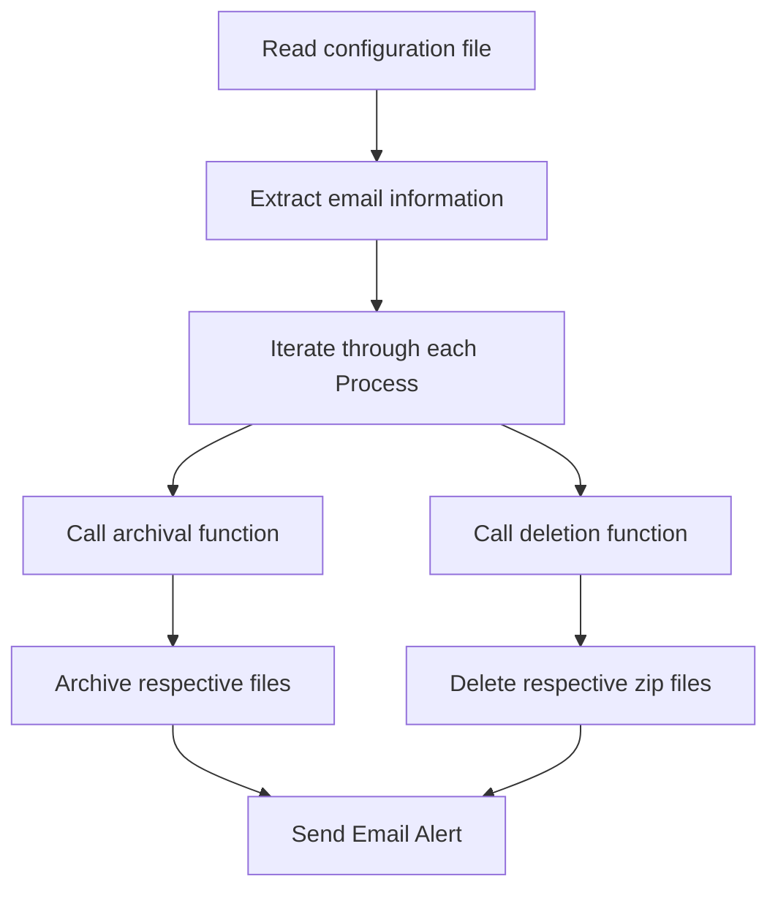

# Framework Chrysalis NAS Archival
The NAS Archival Process was created to mitigate storage constraints in the Network Attached Storage. Its purpose is to archive and delete files after a certain period of days. This process will run as an automated script on Windows.

## Revision History:
|     Date    |   Version   |                                    Description                                  |                Author                 |
|-------------|:-----------:|:-------------------------------------------------------------------------------:|:-------------------------------------:|
| 01/11/2025  |     1.0     | PRJ297967 - Tech Forward - Chrysalis 2.0 NAS Drive Archival |              Alanza Blake             |

## Introduction
1. The NAS Archival Process reads a configuration file that has each process listed that either needs to archive and delete within a particular directory in the NAS.
2. If the process calls for archiving, it compresses content in the given directory that's older than a certain number of days provided in the config. It then add this compressed file in a new archive folder within the directory.
3. If the process calls for deletion, the program looks for already compressed content within a given archive folder to delete after it's been there for a certain number of days listed in the config.

# Frequency
Weekly

# Dependencies

None



# Usage

```sh
python E:\T\src/main.py
```

With runtime arguments:
```sh
python E:\T\src/main.py --process PROCESS1,PROCESS2,PROCESS3
```

## Local Development

### Prerequisites

- Python 3.8

1. Clone the repository

   ```
   git clone https://github.com/uhc-tech-community-state-medicaid/framework-chrysalis-nas-archival.git
   ```

2. Create a virtual environment  
   Windows: `python -m venv .venv`  
   Mac/Linux: `python3 -m venv .venv`

3. Activate the virtual environment  
   Windows: `.venv\Scripts\activate`  
   Mac/Linux: `source .venv/bin/activate`

4. Install the dependencies  
   `pip install -r requirements.txt`

5. Run the application

## API Documentation
### Process Initialization
1. A configuration file with the processes will be created. 
2. For processes that are looking to archive, the information needed in the config is the File Path to be archived, the Archive File Path which will be created for the compressed zip files, the allowed file extensions in a comma separated list, the file purge days which is used to determine whether a file needs to be archived based on their age, and an action field which will read as "Archive" in this case.
3. For the processes that are looking to delete,  the information needed in the config is the Archive File Path which is where the compressed zip files are, the file purge days which is used to determine whether a zip file needs to be deleted based on their age, and an action field which will read as "Delete" in this case.
4. Environment variable SMTP_PORT can be set but is defaulted to 25.

### Process Output
```
Process: PROCESS1
==============++++++++++++=====================
Action: Archive
Archival File Path: //nasv0603/chrysalisnas/Member/PROCESS1/output
Archival Directory: //nasv0603/chrysalisnas/Member/PROCESS1/output/archive
Accepted File Extension: .dat,.DAT
File Purge Days: 10
Added //nasv0603/chrysalisnas/Member/PROCESS1/output\file1.txt to //nasv0603/chrysalisnas/Member/PROCESS1/output/archive\2024\December\file1.txt.zip
Zipped and moved file1.txt to //nasv0603/chrysalisnas/Member/PROCESS1/output/archive\2024\December.
Files archived successfully.
==============++++++++++++=====================
==============++++++++++++=====================
Action: Archive
Archival File Path: //nasv0603/chrysalisnas/Member/PROCESS1/output/done
Archival Directory: //nasv0603/chrysalisnas/Member/PROCESS1/output/done/archive
Accepted File Extension: .dat,.DAT
File Purge Days: 10
Added //nasv0603/chrysalisnas/Member/PROCESS1/output/done\file2.txt to //nasv0603/chrysalisnas/Member/PROCESS1/output/done/archive\2024\December\file2.txt.zip
Zipped and moved file2.txt to //nasv0603/chrysalisnas/Member/PROCESS1/output/archive\2024\December.
Files archived successfully.
==============++++++++++++=====================
==============++++++++++++=====================
Action: Delete
Archival File Path: //nasv0603/chrysalisnas/Member/PROCESS1/output/archive
File Purge Days: 1
Deleted //nasv0603/chrysalisnas/Member/PROCESS1/output/archive\2024\December\file3.txt.zip
Files deleted successfully.
==============++++++++++++=====================
==============++++++++++++=====================
Action: Delete
Archival File Path: //nasv0603/chrysalisnas/Member/PROCESS1/output/done/archive
File Purge Days: 1
Deleted //nasv0603/chrysalisnas/Member/PROCESS1/output/archive/done\2024\December\file4.txt.zip
Deleted //nasv0603/chrysalisnas/Member/PROCESS1/output/archive/done\2024\December\file5.txt.zip
Deleted //nasv0603/chrysalisnas/Member/PROCESS1/output/archive/done\2024\December\file6.txt.zip
Files deleted successfully.
==============++++++++++++=====================
Email alert sent successfully.
```

### Configuration Layout
Please note: The EmailCc field is optional.

```json
{
    "EmailDetails":
    {
        "EmailFrom": "asp_test@uhc.com",
        "EmailDefaultTo": "John_Doe@optum.com"
    },
    "ArchivalProcessName":
    {
        "CHRYSALIS":
        {
            "Process":
            {
                "PROCESS_ONE":
                [
                    {
                        "FilePath": "//nasv0603/chrysalisnas/Member/PROCESS_ONE/output",
                        "ArchiveFilePath": "//nasv0603/chrysalisnas/Member/PROCESS_ONE/output/archive",
                        "FileExtension": ".txt,.TXT",
                        "FilePurgeDays": 10,
                        "Action": "Archive"
                    },
                    {
                        "FilePath": "//nasv0603/chrysalisnas/Member/PROCESS_ONE/output/done",
                        "ArchiveFilePath": "//nasv0603/chrysalisnas/Member/PROCESS_ONE/output/done/archive",
                        "FileExtension": ".txt,.dat",
                        "FilePurgeDays": 10,
                        "Action": "Archive"
                    },
                    {
                        "ArchiveFilePath": "//nasv0603/chrysalisnas/Member/PROCESS_ONE/output/archive",
                        "FilePurgeDays": 20,
                        "Action": "Delete"
                    },
                ],
                "PROCESS_TWO":
                [
                    {
                        "FilePath": "//nasv0603/chrysalisnas/Member/PROCESS_TWO/output",
                        "ArchiveFilePath": "//nasv0603/chrysalisnas/Member/PROCESS_TWO/output/archive",
                        "FileExtension": ".dat",
                        "FilePurgeDays": 300,
                        "Action": "Archive"
                    },
                    {
                        "ArchiveFilePath": "//nasv0603/chrysalisnas/Member/PROCESS_TWO/output/archive",
                        "FilePurgeDays": 150,
                        "Action": "Delete"
                    }
                ]
            },
            "Email":
            {
                "EmailTo": "John_Doe@optum.com",
                "EmailCc": "Jane_Doe@optum.com",
                "EmailSubject": "Chrysalis File Archival",
                "EmailSuccessBody": "Team - Chrysalis File archival completed.",
                "EmailFailureBody": "Team - Chrysalis File archival failed, please refer the log for more details."
            }
        }
    }
}
```

### DAG Details

### Process Overview:
1. The program then reads the provided configuration file. It extracts the email information provided for sending an alert at the end of the program to see if it succeeded or failed.
2. It then loops through the list of processes. If the program was ran with the runtime argument called processes, then it will only be running for the specific processes listed in the comma separated string. If the program was ran with no runtime argument then it iterates through the entire list of processes.
3. For each process, it checks the action field in the list for each individual process to see if the action is listed as either "Archive" or "Delete".
4. If it's listed as archive, it calls a function for archiving the files. This function looks for files in the file path provided in the config with the given extensions. If the file is older than or equal to the number of purge days, it gets compressed. It's then added to an archive folder created within the file path and within the archive folder, it's placed in sub folders based on its date (Example: if a file is from September 2024, two sub folders are created and it's placed in the 2024/September path in the archive folder.)
5. If the action field is delete, it calls a delete function. It loops through the archive path to see compressed zip files that are older than or equal to the amount of file purge days. These zip files then get deleted.
6. Once every process is completed, an email alert is sent to the point of contact listed that gives them a success message. If at any time something fails, an email alert will be sent that provides a failure message. Each email alert sends a log of the program view the successful or failed process.

### Technology Used
1. Python 3.12